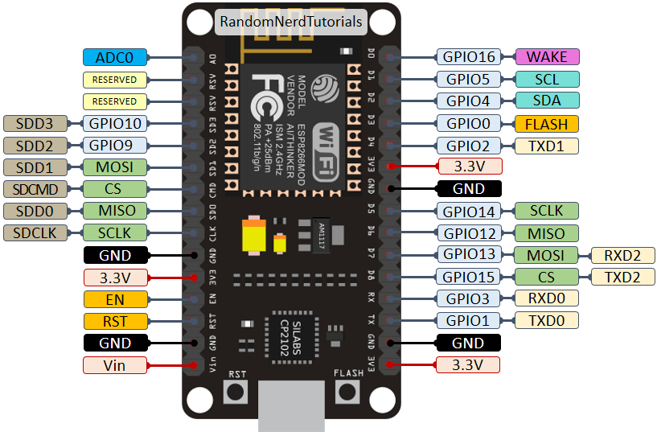
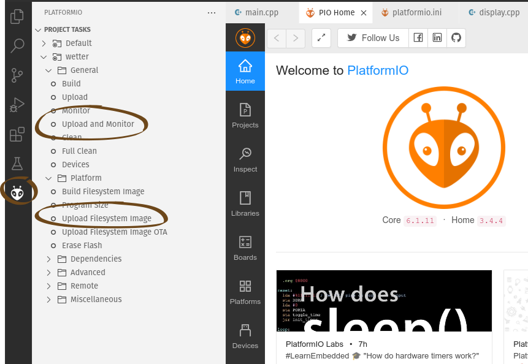

# Arduino Workshop

## Erste Aufgabe
bringt das Projekt "inital" zum laufen

## Hardware
ESP8266 - CP210x
Der ESP8266 ist ein kostengünstiger Mikrocontroller mit integriertem Wi-Fi. Er ist ideal für IoT-Projekte.

Taktfrequenz: 80 MHz (kann auf 160 MHz übertaktet werden)
RAM: ca. 36 KB (für den Benutzer verfügbar)

https://randomnerdtutorials.com/esp8266-pinout-reference-gpios/

## GPIOs
Die GPIOs (General Purpose Input/Output) können zwei Zustände haben: 0 (aus) und 1 (an).
Es können nur kleine Lasten geschaltet werden, Typischerweise bis zu 12 mA pro Pin.

###  PWM (Pulse Width Modulation): 
Ermöglicht es, die Ausgangsspannung zu variieren, um z.B. die Helligkeit einer LED zu steuern.

## Schnittstellen
Der ESP8266 bietet verschiedene Schnittstellen, um mit anderen Geräten zu kommunizieren:

### Analog Read von A0: 
Erlaubt das Lesen von analogen Signalen.

### I2C: 
Ein Bus-System, um mit Sensoren und anderen Geräten zu kommunizieren.

### SPI: 
Ein weiteres Bus-System, ideal für schnelle Datenübertragungen.

## PlatformIO und platform.ini
PlatformIO ist eine Entwicklungsumgebung für Mikrocontroller. Es ist eine Alternative zur Arduino IDE und bietet viele erweiterte Funktionen.

Die platform.ini Datei ist eine Konfigurationsdatei für PlatformIO-Projekte. 
Hier werden Einstellungen wie der Mikrocontroller-Typ, die verwendete Plattform und Bibliotheken festgelegt.

    [env:wetter]
    platform = espressif8266
    board = nodemcuv2
    framework = arduino
    build_flags = 
        -DASYNCWEBSERVER_REGEX
    lib_deps = 
        adafruit/Adafruit SSD1306@^2.5.7
        me-no-dev/ESP Async WebServer@^1.2.3
        claws/BH1750@^1.3.0
        adafruit/Adafruit BMP085 Library@^1.2.2
    board_build.filesystem = littlefs

## Sensoren und Module

### BH170: 
Ein Lichtsensor.
### BMP180: 
Ein Barometer zur Messung des Luftdrucks.
### TCRT5000: 
Ein Infrarot-Reflexionssensor.
### OLED Panel 128 x 64 Pixel 0.96 Inches: 
Ein kleines Display zur Anzeige von Informationen.
### ESP-12E ESP8266 IoT WiFi Motorshield L293D: 
Ein Motor-Treiber-Board, das den Anschluss und die Steuerung von Motoren ermöglicht.

## Übersicht über die ESPs

### ESP8266: 
Der "klassische" ESP mit Wi-Fi.
### ESP32: 
Ein leistungsfähigerer Mikrocontroller mit Wi-Fi und Bluetooth.
